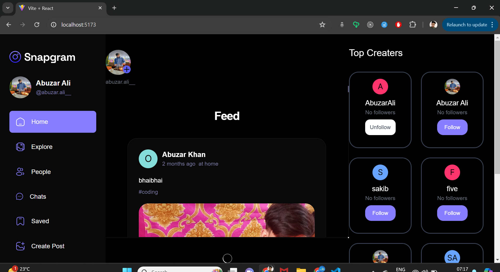
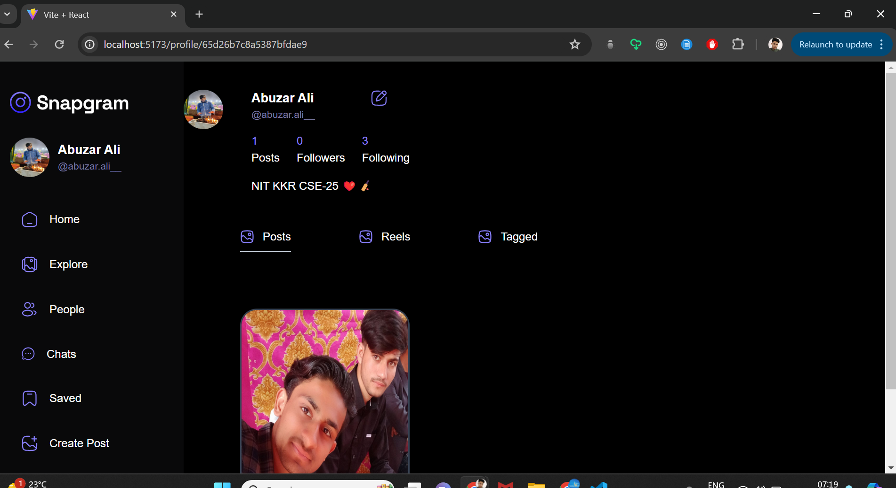
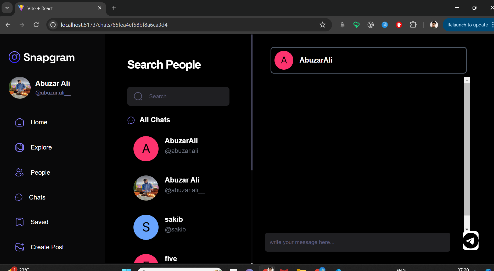
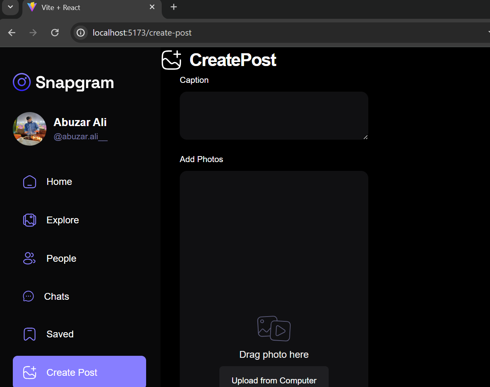
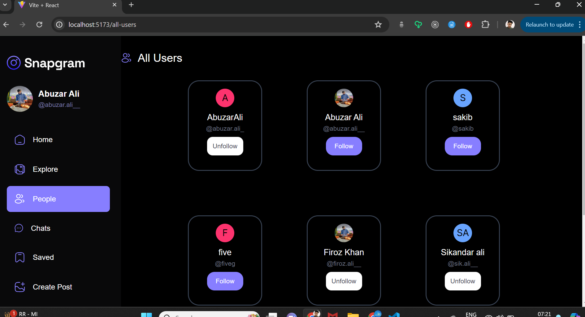

# Snapgram: React-based Instagram Clone

Snapgram is a React-based application that serves as a clone of Instagram, providing similar functionalities in a familiar interface. With its frontend built using React.js, Snapgram leverages reusable components to ensure efficient development and maintainability. Components are designed to be versatile, allowing them to be utilized in various parts of the application for consistent user experience.

# Key Features:
- Utilization of React Query for efficient data fetching from the backend, ensuring optimal performance and responsiveness.
- Integration with Appwrite as a backend service, facilitating user authentication and enabling seamless login and signup processes.
- User-centric functionalities including account creation, posting images, liking and commenting on posts, and following other users.
- Robust profile management capabilities allowing users to edit their profiles, as well as edit or delete their posts for content control.
- User profiles display key information such as follower count, following count, and other relevant metrics, enhancing user engagement and interaction.
- Implementation of React Hook Form and zod for frontend form validation, enhancing data integrity and user experience with streamlined input handling.
- Styling enhancements achieved through the use of shadcn components, ensuring visually appealing UI elements such as forms, buttons, and notifications.

# Technologies Used:

- React.js: Frontend library for building user interfaces.
- React Query: Efficient data fetching library for seamless communication with the backend.
- React Hook Form: Frontend form validation library for enhancing data integrity and user experience.
- Zod Library: Utilized for frontend form validation, ensuring robust input handling and validation.
- Tailwind CSS: Styling framework for building responsive and visually appealing UI components.
- Shadocn Components: Enhanced styling components such as forms, buttons, and notifications for a polished user interface.
- Appwrite: Backend service utilized for user authentication and seamless integration with Snapgram's frontend.

# Usage:
``` bash
1. Clone the repository to your local machine:
- git clone <repository_url>
2. Navigate to the project directory:
- cd <projectname>
3. Install the required dependencies using npm:
- npm install
4. Create a .env file based on the provided .env.sample file and fill the necessary environment variables as required by the project.
5. You can now start interacting with the application using the following commands:
- npm run dev

This command will start the development server and enable you to begin interacting with the application.
```
# Contributing:
Contributions to Snapgram are welcome! Feel free to submit pull requests or raise issues for any improvements or features you'd like to see added.

# ScreenShots




